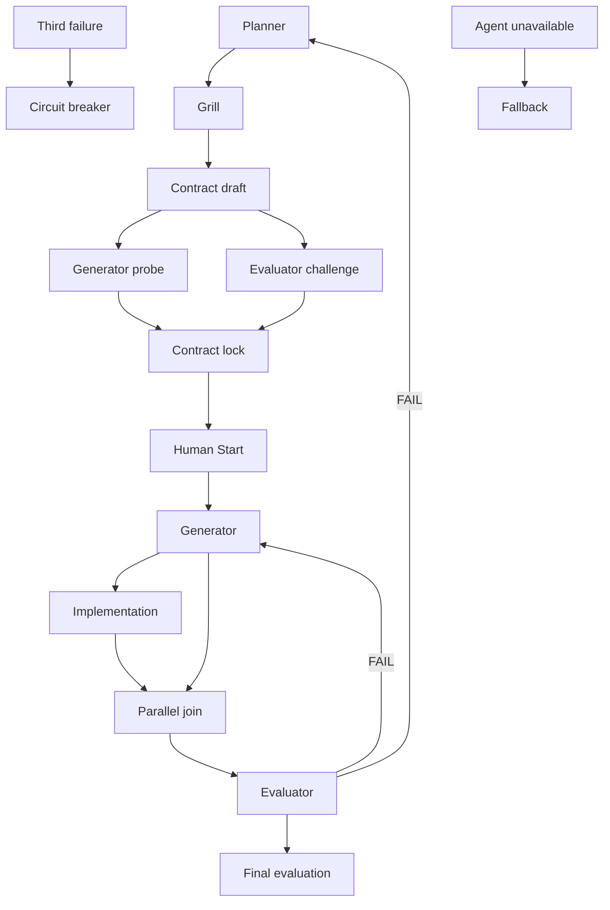

# PGE Protocol

> status: active
> owner: pge-protocol
> layer: profile
> 本文件负责 Planner / Generator / Evaluator 的 code-behavior state machine、artifacts 和 acceptance gates；runtime orchestration 归 `$pge-workflow`。

## Activation

PGE 用于 medium+、critical-flow、public-interface、state/schema、cross-module、batch 或 independently accepted 的**代码行为**工作。Small local code work 在 Coding Start Check 后可 solo，但仍需 proportional verification/review。

Harness、文档与其他 non-code 更新不使用 PGE，也不因文件数量、hook 或静态 configuration 而触发 Human Start。若一个任务同时改代码行为和非代码 artifact，按代码行为整体评估 PGE。

## Roles

- Planner 拥有 facts、decision、Contract revision、slice 和 Human Start recording。
- Generator 只实现 locked 且 human-approved Contract，不编辑 Contract 或 evaluation。
- Evaluator challenge draft，随后独立评估 integrated diff；不修复 code/tests。
- Human owner 解决 business choice、批准一个 Contract revision 的 implementation，并接受任何 `PASS_WITH_NOTES` risk。

## Normative Flow



Pre-Challenge review 不需要 Human Start approval。

## Sprint Contract

`docs/pge/<sprint>-spec.md` 记录：

- goal、scope、acceptance、non-goals 和 implementation order；
- branch label、Review base/candidate 的 immutable full commit SHA；最终 diff 使用 `git diff <base-sha>...<candidate-sha>`；
- approved behavior/test seams 或 targeted verification boundary；
- first tracer bullet、`verify_cmd`、risk、circuit breaker、Grill closure、independent challenge、parallel slices、fallback 和 Human Start state。

Contract 绑定 behavior/evidence，不绑定不必要的 helper、interface 或 abstraction shape。scope change 回到 Planner 并递增 `contract_revision`。

Final evaluation 从 clean candidate commit 开始。`git status --short` 不得存在 staged/unstaged in-scope production/test/document change，所有 untracked path 必须分类；dirty bytes 不被 `git diff <base>...<candidate>` 覆盖，因而阻止 evaluation。

## Human Start

只有以下条件同时成立时，code implementation 才能开始：

```text
approved_contract_revision == contract_revision
channel != ""
evidence != ""
```

此外必须 `status == "approved"`。locked Contract、Grill confirmation、silence、fallback 或 older revision approval 都不足够。

## Required Agent Context

Agent prompt 中 standalone `@path` 是 Harness convention，不是 native Codex include。dispatch 前要求 Agent 直接读取每个路径；必读 `harness/coding-style.md` 与 `harness/code-shape.md`，locked Contract 和 relevant owner 通过 `AGENTS.md` discover。

## Generator

- Pre-contract mode 只返回 implementation probe，不编辑。
- Implementation mode 核对 Human Start、branch/worktree、scope 和 required context。
- Behavior code 调用 `$tdd`；Contract-approved seam 满足该 Skill 的 prior user confirmation，只有 unresolved behavior choice 才再问。
- Non-behavior **code** 使用 Contract 的 targeted verification，不制造 RED/GREEN ceremony。
- 全部相关 behavior tests GREEN 后，按 injected standards 做 author Review；只针对 concrete current-change finding refactor，然后重跑 affected verification。
- 返回 changed scope、behavior-test / targeted-verification evidence、triggered schema、`verify_cmd` 和 residual risk。

## Evaluator

Challenge mode 检查 draft 是否 testable、complete、independently decidable，且没有不必要 frozen shape。

Evaluation mode：

1. 核对 Human Start、required context、Contract revision、immutable Review base SHA、clean candidate SHA、classified untracked path 与 scope。
2. 完整阅读 production diff，并在 tests/Generator rationale 前冻结 **Standards** finding set。
3. 独立检查 **Spec** 的 missing/incorrect behavior 与 scope creep。
4. 阅读 tests、Generator evidence、integration/document risk，并应用 `harness/code-review.md` severity。
5. 只返回 `PASS`、`PASS_WITH_NOTES` 或 `FAIL`；未解决 Critical/Major 必须为 `FAIL`。

## Parallel And Fallback

Parallel code work 需要 independently acceptable slice、disjoint file、separate branch/worktree 和 slice-level `verify_cmd`。shared public interface、schema、state machine、migration、generated file 或 helper hot zone 保持 serial；Planner 负责 integration/final verification。

required Agent 不可用时，记录 collapsed role、lost guarantee、mitigation、restore condition、self-review state、owner acknowledgement 与 independent Evaluator assurance。fallback 不绕过 Human Start，也不能把 generic reviewer 伪装成缺失的 Evaluator。

## Circuit Breaker

同一 interface/flow 三次失败后停止 patching，记录 evidence/recovery condition，回到 Planner 或 owner。`FAIL` 阻止 close；`PASS_WITH_NOTES` 仅在 explicit owner acceptance 后关闭。
